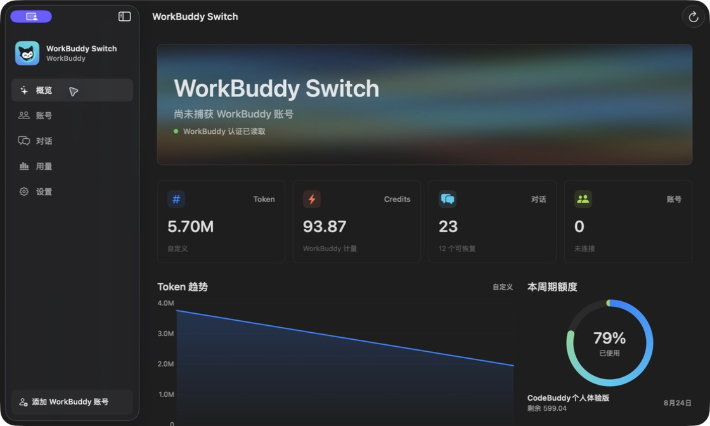
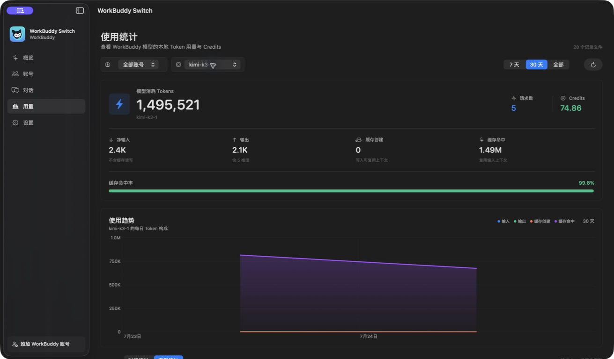

<div align="center">
  

  <h1>WorkBuddy Switch</h1>

  <p>
    <strong>切换 WorkBuddy 账号、继续任意对话、看清每一笔 Token 与 Credits。</strong>
    <br />
    原生、轻量、本地优先的 macOS 管理器。
  </p>

  <p>
    <a href="https://github.com/koi128bit/WorkBuddy-Switch/releases/latest">
      
    </a>
  </p>

  <p>
    <a href="https://github.com/koi128bit/WorkBuddy-Switch/releases/latest">
      
    </a>
    
    
    <a href="LICENSE">
      
    </a>
  </p>

  <p>
    <a href="#快速开始">快速开始</a>
    ·
    <a href="#安全与隐私">安全与隐私</a>
    ·
    <a href="CHANGELOG.md">更新日志</a>
    ·
    <a href="https://github.com/koi128bit/WorkBuddy-Switch/issues">反馈问题</a>
  </p>
</div>

<p align="center">
  
</p>

## WorkBuddy 多账号，不必从头再来

WorkBuddy 会按账号隔离本地会话。切换账号后，旧对话通常仍在磁盘上，却不会出现在
当前账号的界面里；同时，Token、Credits 和周期额度散落在本地记录与服务端接口中，
很难快速看清。

WorkBuddy Switch 把账号快切、跨账号续聊和用量分析放进一个原生 macOS 应用。
你不需要反复登录，也不需要手动修改 SQLite 数据库。

## 核心能力

<table>
  <tr>
    <th width="33%">账号快切</th>
    <th width="34%">跨账号继续对话</th>
    <th width="33%">Token 与 Credits</th>
  </tr>
  <tr>
    <td>
      将当前登录状态安全保存到 macOS Keychain。一键切换时自动保存出站账号、
      原子替换凭据并重启 WorkBuddy。
    </td>
    <td>
      搜索、筛选和恢复历史对话。跨账号继续时，只迁移你选中的会话到当前账号，
      不切回原账号。
    </td>
    <td>
      按账号、模型和日期查看输入、输出、缓存、思考 Token、Credits、请求数与排行，
      并对照当前账号周期额度。
    </td>
  </tr>
</table>

- **今天优先**：默认展示当天数据，也可选择 7 天、30 天、全部或自定义日历区间。
- **持续更新**：会话与本地用量每 15 秒刷新；额度可手动刷新或按设置周期更新。
- **菜单栏入口**：不打开主窗口，也能查看摘要、刷新额度和快速切换账号。
- **安全备份**：任何会话迁移前都会创建一致性数据库备份，并保留最近 5 份。

<p align="center">
  
</p>

## 快速开始

> [!IMPORTANT]
> 需要 macOS 13 Ventura 或更高版本，以及 WorkBuddy macOS 桌面版。
> 发布包为 Universal App，同时支持 Apple Silicon 和 Intel Mac。

1. 前往 [最新 Release](https://github.com/koi128bit/WorkBuddy-Switch/releases/latest)。
2. 下载 `WorkBuddy-Switch-<version>-universal.dmg`。
3. 打开 DMG，将 `WorkBuddy Switch.app` 拖入 `Applications`。
4. 启动 WorkBuddy Switch，在 WorkBuddy 中登录后选择“保存当前账号”。

> [!NOTE]
> 当前 GitHub Release 使用 ad-hoc 签名，尚未经过 Apple 公证。首次启动时，请在
> Finder 中右键应用并选择“打开”。后续可以正常双击启动。

保存第二个账号时，先在 WorkBuddy 中登录该账号，再回到 WorkBuddy Switch
保存当前状态。之后即可在主窗口或菜单栏一键切换。

## 跨账号续聊如何保证安全

当你在账号 B 登录状态下继续账号 A 的会话时，WorkBuddy Switch 会：

1. 确认当前 WorkBuddy 身份仍是账号 B。
2. 安全停止 WorkBuddy，并检查是否存在交互式 CLI 会话。
3. checkpoint SQLite WAL，并在 `~/.workbuddy/migrate_backups/` 创建完整备份。
4. 在受保护事务中，只把所选会话迁移到账号 B；其他会话保持不变。
5. 再次验证迁移结果，然后用当前账号 B 打开该对话。

**“迁移并继续”不会切换到对话原来的账号。** 如果迁移后的检查失败，应用会使用
迁移前备份自动恢复数据库；失败备份会保留，方便人工排查。

## 安全与隐私

| 数据 | 处理方式 |
|:---|:---|
| WorkBuddy 凭据 | 账号快照存入 macOS Keychain；access token 和 refresh token 不展示、不记录日志 |
| 对话元数据 | 只读取本机 `~/.workbuddy/workbuddy.db`；仅在恢复所选会话时写入 |
| Token 用量 | 在本机流式解析 `~/.workbuddy/projects/**/*.jsonl`，不上传对话内容 |
| 数据库备份 | 迁移前使用 SQLite online backup；备份权限为 `0600`，最近保留 5 份 |
| 网络请求 | 只有额度刷新会访问 WorkBuddy 资源接口，使用当前登录账号凭据 |

完整安全说明和漏洞报告方式见 [SECURITY.md](SECURITY.md)。

## 用量口径

<details>
<summary><strong>Token 如何统计？</strong></summary>

每条 assistant 消息读取 `providerData.rawUsage`：

```text
净输入 = prompt_tokens - prompt_cache_hit_tokens
输出   = completion_tokens
缓存读 = prompt_cache_hit_tokens
缓存写 = prompt_cache_creation_tokens
思考   = completion_thinking_tokens（输出的子集）
总量   = prompt_tokens + completion_tokens
```

会话 ID 通过 SQLite `sessions.user_id` 映射到账号。重复文件优先使用消息 ID 去重；
缺少消息 ID 时使用稳定内容哈希，避免恢复或复制记录后重复计数。

</details>

<details>
<summary><strong>为什么模型 Credits 可能低于 WorkBuddy 显示的周期消耗？</strong></summary>

WorkBuddy 的额度接口只返回当前账号的周期总额，不提供模型级账单。模型 Credits
只统计本地日志中带 `usage` 的记录，因此 Kimi K3 等模型的本地可归因值可能低于
实际消耗。

界面会把“服务端周期已用”“本地可归因”和“未归因”分开显示，不会根据 Token
数量猜测 Credits。

</details>

## 兼容性

| 项目 | 支持情况 |
|:---|:---|
| macOS | 13 Ventura 或更高版本 |
| Mac 芯片 | Apple Silicon 与 Intel |
| WorkBuddy | macOS 桌面版；当前在 5.3.3 上验证 |
| 界面语言 | 简体中文 |
| 刷新频率 | 本地会话与用量 15 秒；额度 5/10/30/60 分钟或手动 |

WorkBuddy 的本地格式可能随版本变化。如果升级 WorkBuddy 后出现数据库或用量解析问题，
请附上 WorkBuddy 版本号提交 [Issue](https://github.com/koi128bit/WorkBuddy-Switch/issues/new)；
不要上传凭据、数据库或包含对话内容的 JSONL 文件。

## 本地构建

需要 Apple Command Line Tools 和 Swift 5.10+：

```bash
git clone https://github.com/koi128bit/WorkBuddy-Switch.git
cd WorkBuddy-Switch
scripts/test.sh
scripts/build-release.sh
```

产物位于 `dist/`。构建 Universal 包：

```bash
OPENUSAGE_ARCHS="arm64 x86_64" scripts/build-release.sh
```

Developer ID 签名与公证：

```bash
OPENUSAGE_SIGN_IDENTITY="Developer ID Application: Your Name (TEAMID)" \
OPENUSAGE_NOTARY_PROFILE="notary-profile" \
OPENUSAGE_ARCHS="arm64 x86_64" \
scripts/build-release.sh
```

## 常见问题

<details>
<summary><strong>点击继续对话时，会切换到原账号吗？</strong></summary>

不会。当前账号就是目标账号。不同账号的会话会先迁移所选记录，再在当前账号中打开。

</details>

<details>
<summary><strong>会修改所有旧账号的对话吗？</strong></summary>

不会。迁移使用会话 ID 和预期源账号双重条件，只更新你选中的一条记录。

</details>

<details>
<summary><strong>数据库损坏了怎么办？</strong></summary>

迁移前必须成功创建 SQLite 备份，否则不会执行写入。迁移后的验证失败时会自动回滚。
备份位于 `~/.workbuddy/migrate_backups/`。

</details>

<details>
<summary><strong>为什么 macOS 提示无法验证开发者？</strong></summary>

当前公开构建尚未使用 Developer ID 公证。请确认文件来自本仓库的 Release 页面，
然后在 Finder 中右键应用并选择“打开”。

</details>

## 反馈与贡献

- Bug 或功能建议：[GitHub Issues](https://github.com/koi128bit/WorkBuddy-Switch/issues)
- 版本变化：[CHANGELOG.md](CHANGELOG.md)
- 安全问题：[SECURITY.md](SECURITY.md)
- 参考项目与固定修订：[THIRD_PARTY_NOTICES.md](THIRD_PARTY_NOTICES.md)

欢迎提交 Issue 和 Pull Request。涉及 WorkBuddy 本地格式的报告请先脱敏，不要提交
access token、refresh token、账号快照、数据库或原始对话日志。

## 致谢与许可

WorkBuddy Switch 参考了
[workbuddy-account-migrate](https://github.com/xiaoliuzhuan666/workbuddy-account-migrate)、
[usageBar](https://github.com/ChanningYuan/usageBar) 和
[CC Switch](https://github.com/farion1231/cc-switch) 的兼容数据格式与交互思路。
具体修订和许可证信息见 [THIRD_PARTY_NOTICES.md](THIRD_PARTY_NOTICES.md)。

本项目以 [MIT License](LICENSE) 发布。

WorkBuddy Switch 是独立开源项目，不隶属于、未获腾讯、WorkBuddy、Kimi、CC Switch
或 usageBar 官方认可或赞助。

<div align="center">
  <strong>如果它解决了你的问题，欢迎点一个 Star，让更多 WorkBuddy 用户找到它。</strong>
</div>
